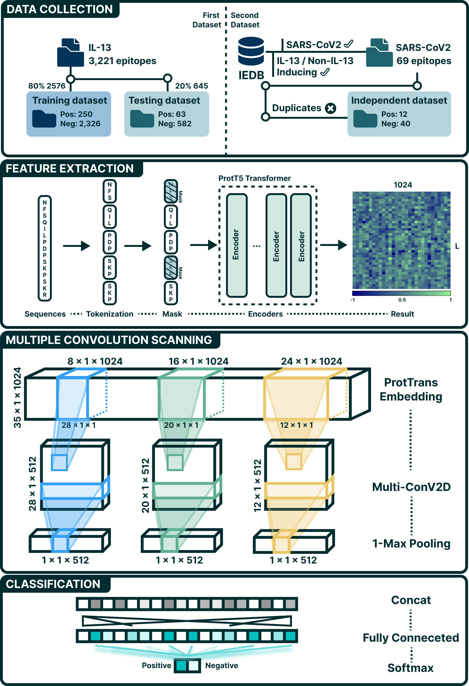

# DeepEpiIL13: Deep Learning for Rapid and Accurate Prediction of IL-13 Inducing Epitopes using Pre-trained Language Models and Multi-Window Convolutional Neural Networks

## Introduction 
This study introduces a powerful deep learning framework for accurate epitope prediction, offering new avenues for the development of epitope-based vaccines and immunotherapies targeting IL-13-mediated disorders. The successful identification of IL-13-inducing epitopes paves the way for novel therapeutic interventions against allergic diseases, inflammatory conditions, and potentially severe viral infections like COVID-19. 
 
 

 
The workflow for IL-13 inducing prediction model.

## Dataset 
